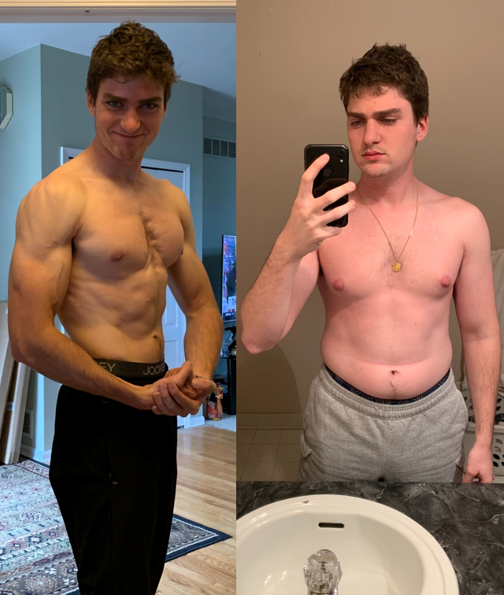
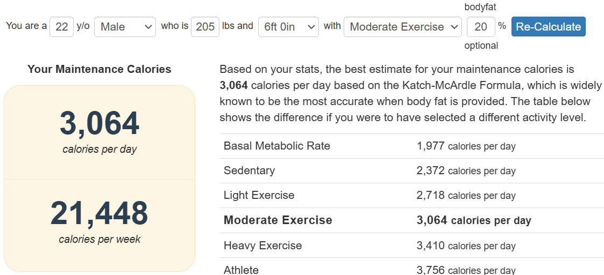
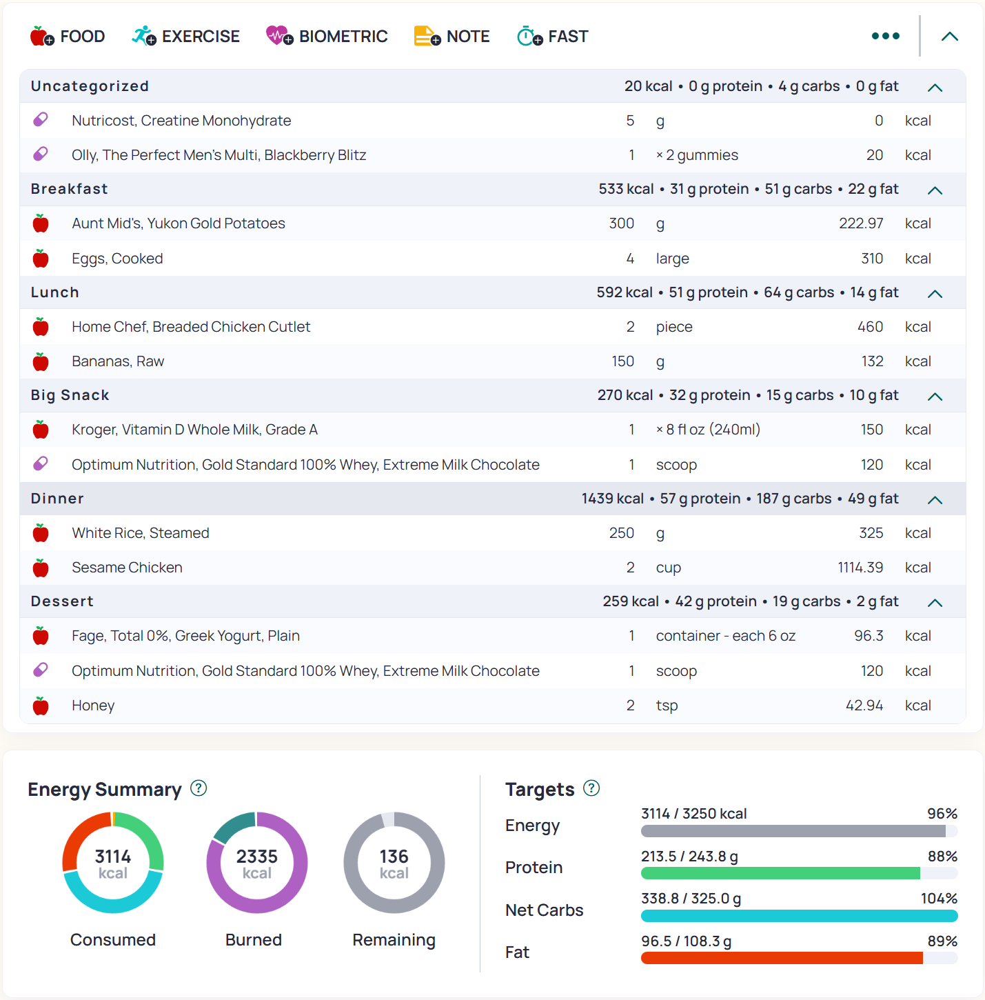
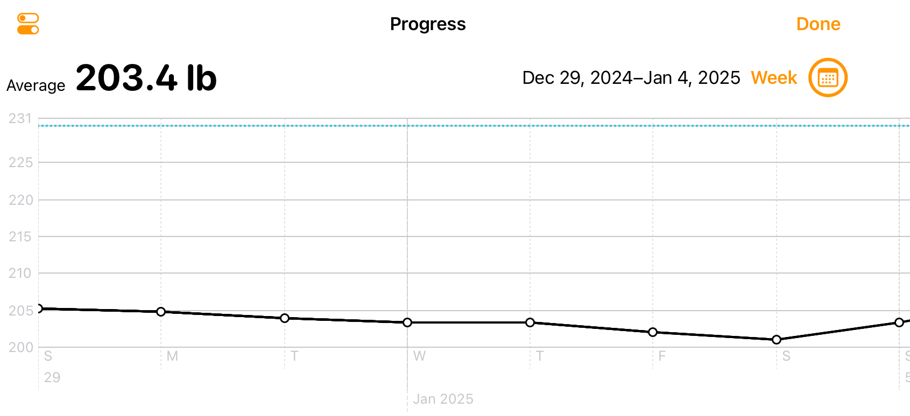
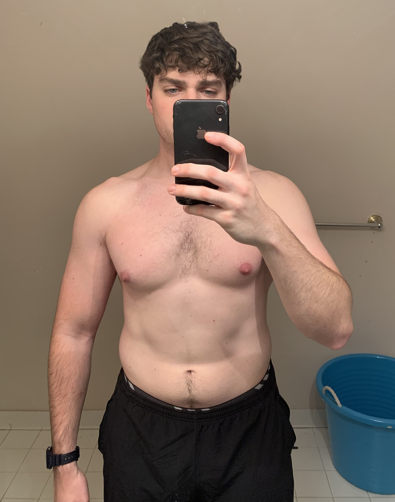

## My #1 goal for 2025 is to gain 20 lbs of muscle. 
Or ~0.5 lb of weight gain per week, resulting from ~250 calorie surplus per day. 
 
Ambitious? ✅ Challenging? ✅ Possible? Let's find out. 

Previously on "Get Jacked or Die Trying", I achieved my goal of `1-2-3-4 lifts` (1 plate overhead press, 2 plate bench press, 3 plate squat, and a 4 plate deadlift) late last year. Not too shabby for a mediocre lifter making a comeback in early 2024. 

<!--  -->

     

I say 'mediocre' because up to setting out to achieve this strength goal, I never really set a goal for the gym. My workouts were inconsistent, lacked effort, and my diet was _shit!_

I've been **fat** to **fit** to **fat again** more times than I can count - <ins>left me</ins> is a cardio queen road biking 100+ mile weeks in college 🚴, and <ins>right me</ins> is the aftermath of multiple late night binge eating sprees 😡.
<!--  -->

     

All of this to say, what if I went all in this year? What amount of progress could I make if I tracked every: 
- Morning weigh-in?
- Calorie consumed?
- Weight lifted?
- Rep performed?

Like I said, there's only one way to find out... 

>## "Plan the Work, Work the Plan"

### Nutrition

Here's how I'm going to "lean" bulk for the entire year of 2025 and gain 20 lbs of muscle. 

First, I establish my <a href="https://tdeecalculator.net/" target="_blank">Total Daily Energy Expenditure (TDEE)</a>, or the amount of calories my body burns in a day:

Starting out, my maintenance calories is ~3000 cal per day, putting my bulking calories at ~3250 cal per day to target for ~0.5 lb weight gain per week. This number will increase throughout the bulk as **more gains** are made. 

I track my caloric intake using a free app called Cronometer. I like this app because I can easily see my calories consumed and macro distribution in a given day. Plus it supports barcode scanning to log food! 

For example, here's what I ate today:

I generally eat the same foods every day: eggs, potatoes, chicken, rice, whey protein, greek yogurt, bananas, apples, and _occasionally_ some vegetables. 

I follow the old school bodybuilding rule of **1 gram of protein per pound of body weight**. I also try to stick to whole foods, avoiding anything highly processed or high in sugar. 

:::tip
"Loose tracking" calories/macros, at least on a bulk, is usually more sustainable. For example, I eat my mom's cooking every night for dinner, and instead of trying to micro manage every ingredient, I'll just weigh my portion size with a food scale and estimate the calories/macros by selecting the closest food item in the app. 
:::

I validate I'm eating the correct amount of food by tracking my body weight. For consistency, I weigh myself every morning as soon as I wake up and right after I take a leak - that one pound makes a big difference, ok? 😂

I log my weight in a free app called Weigh In: Weight Tracker. I like it because it's very simple and I can graphically see my daily weigh-ins, with my average body weight for a given week. This allows me to make sure I'm on track to the +0.5 lb/week target, and can adjust caloric intake accordingly. 

### Training 

> For lifting, basically just lift heavy shit and work your ass off. 

Or in other words, practice progressive overload, simply meaning every time you step foot in the gym, try to add a rep or a small increment of weight to the same excercise you did last time. 

Some other guiding principles to follow: 

- Train to failure (or within 1 rep) - put in **<ins>MAX</ins>** effort
- Focus on mind-muscle connection
- Time under tension = slow and controlled _eccentric_ --> ~Lift~ Lower weights 

As far as volume goes, I keep my workouts to 10ish hard sets because I like to keep training intensity high while being in the gym <1 hour.  

Here's a sample program from an upper/lower + arm/extra day split I've been running for the past few months: 

#### Upper 1 - Mon 
- DB shoulder press / BB overhead press 2x6-10 
- Wide-grip lat pulldown 2x8-12
- Close-grip bench press 2x8-12
- Cable row / High row 2x8-12
- Barbell curl 2x8-12

#### Lower 1 - Tues
- Hack squat / Smith squat 2x6-10 
- Seated leg curl 2x8-12 
- Bulgarian split squat 2x8-10
- Hip thrust 2x15 
- Calf raises 2x15

#### Upper 2 - Thurs 
- Incline bench press / Bench press 2x6-10 
- Close-grip lat pulldown 2x8-12
- Pec deck / Cable fly 2x10-12 
- Pendlay row 2x8-12 
- DB French press 2x8-10 

#### Lower 2 - Fri 
- Leg press 2x8-10
- Romanian deadlift 2x8-10  
- Lying leg curl 2x8-12 
- Leg extension 2x10-15 
- Calf raises 2x15 

#### Arms - Sat 
- Preacher curl 2x8-12
- French press 2x8-12
- Incline DB curl / Single arm cable curl 2x8-12
- DB skull crushers 2x8-12
- DB / Cable lateral raises 2x10-15 
- Shrugs / Rear delt fly / Reverse cable fly 2x10-15

Rest times are typically 2-3 mins, or more if needed. Additionally, some sets are taken past failure via partial reps. 

:::note
Although programming/exercise selection are very important, don't hyperfixate on what the _"most optimal"_ way to train is. Relating back to **sustainability**, prioritize exercises that you 1. <ins>enjoy</ins> and 2. <ins>feel the best.</ins> 

If you're not having fun, then why are you even doing it? 
:::

Don't worry, I'm not a complete <a href="https://www.youtube.com/shorts/6O-rFD3BV3c" target="_blank">cardio skipper</a>. Most commonly, I'll take my dog for a walk or do some incline walking on the treadmill. Ideally, I am getting in some steps every day, especially since I work an office job. At a minimum, I'll walk/go for a short jog on my rest days, so 2x per week. 

## Baseline 

Well... there's nothing left to do other than to <a href="https://www.youtube.com/watch?v=c52zWyNPfLY&list=PL2yJD_a3fPOeuzD3RanMm7Y4PPbPxyin7&index=17" target="_blank">get after it.</a> Checking in with the starting physique below:  

See you in 1 year 👋.