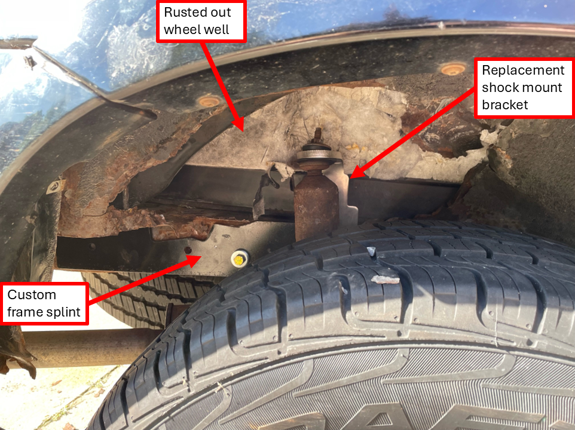

## Why?

I've been driving a 2005 Ford Escape since highschool because it only costs me **$170/mo**... for everything.

I get questioned a lot on why I still drive my car; my family think it's unsafe, my friends think it's funny, and my coworkers think it's lame (I work for a car company that's not Ford). The answer is because it's `dirt cheap!`

I mean sure, it is 20 yrs old... but it only has 140k miles on the odometer. And you know what they say,
> "If it ain't broke, dont fix it."

Honestly, if it were up to me, my trusty steed of choice would be my bike (like in college). But Detroit being home to the auto industry means that you practically need a car to get around here - everything is spaced out, no bike lanes, little to no public transportation. 

You can probably tell from the opener that the biggest deterrent preventing me from buying a new car today is cost. I just cannot justify the value, especially when my current car is so damn cheap. Have you _seen_ the price of new cars lately? In 2024, the average transaction price for <a href="https://www.edmunds.com/industry/press/uncharted-territory-edmunds-forecasts-16-2-million-new-vehicle-sales-in-2025-amid-policy-uncertainty-ongoing-affordability-challenges.html#:~:text=The%20average%20transaction%20price%20(ATP,increase%20from%20%2420%2C618%20in%202019." target="_blank">new vehicles was $47,465!</a> 😯

Consider this. "My car made me rich" said no rich person ever. 

I mean don't get me wrong, it would be dope to <a href="https://www.youtube.com/watch?v=SsZ-0AzryUg&ab_channel=Loki%26Geek" target="_blank">pull up to a function Paul Walker style</a> every once in a while (2F2F is my favorite btw). And that day will come... eventually. But if you're a youngin like myself, I think it's important to practice a little delayed gratification, especially in the wealth accumulation years of your career. 

I love cars. I think they're really cool. But I have a confession to make - I really only care about getting where I have to go. That's it. Point A to point B, in a safe and reliable (enough) way for the lowest cost. 

## Total Cost of Ownership

Let's take a closer look at exactly just how much I'm paying (and subsequently saving) by continuing to drive a `beater mobile.` 

The Escape is a family hand-me-down, so technically, I didn't pay anything for it. However, I will include the price of the vehicle in this analysis, since cars aren't free (ignoring time value of money):

| Item:        | Annual Cost: | Notes:                                           |
| ------------ | ------------ | ------------------------------------------------ |
| Car          | $1,500       | $30k (new in 2005) / 20yrs life (so far).        |
| Fuel         | $1,040       |~\$40/biweekly for ~250mi of driving at $3.25/gal |
| Insurance    | $700         | PLPD, classified as station wagon (don't ask how) |
| Registration | $100         |
| Maintenance  | $100         | 2x oil changes/yr at ~$50/ea                     |
| Repair       | $100         | estimated. nothing major so far (knock on wood)

| Cost Summary: |             |                                                  |
| ------------ | ------------ | ------------------------------------------------ |
| Total Annual Cost           | $3,540       |                                   |
| Total Monthly Cost          | $295         | or $170/mo excluding price of car |
| Cost per Mile               | $0.54        | total cost/miles driven = $3,540/(250mi*52weeks/2) |

Sure, there will be some variation in the operational/capital expenses based on driving frequency, travel distance, make & model, etc. But as you'd expect, it doesn't get any better than this for the cost of car ownership folks. 

:::warning
What's coming next is gonna blow your mind. 🚨
:::

The average cost of car insurance (full coverage) for a new vehicle in the <a href = "https://www.bankrate.com/insurance/car/average-cost-of-car-insurance-in-michigan/" target="_blank">state of Michigan today is $3,049/yr!</a> 

What a S-C-A-M if I've ever heard of one! You're telling me I'm supposed to drop 3 bands just to be able to drive my new car around with a peace of mind?!? That costs nearly as much as all of my car expenses combined, just for insurance alone... No way, Jose! 

Now you might be saying it's a bit unfair to compare the beater with the low cost, state-mandated min coverage to a new car with full coverage, but that's the beauty in the beast - you don't care if your car gets wrecked _because_ it's a beater. That's the whole point! You get the benefits of both worlds; peace of mind and low cost. 

- Someone scratched your car? Don't care, it's a beater. 
- Fender bender? Don't care, it's a beater. 
- Concerned about theft? Guess what? Don't care, it's a beater - nobody else wants it! 😂

## A Tale Too Good to be True

Now, it's not all sunshine and rainbows driving a beater. Everyone dreads the moment you hop in your car in the morning to go to work... and it doesn't start. Reliability is a very real concern, and a blown engine or transmission is likely sending your car to the scrap yard. 

That being said, if you enjoy working on things and have a mechanically inclined friend/family member, you can likely tackle most repairs yourself. 

The Beast has had its fair share of problems:

- **Exhaust leak** - pipe broke in half due to rust (car is parked outside year-round). **The Fix =** some sheet metal and 2 hose clamps. Although, the car is still louder than normal, hence its nickname, "The Beast."
- **Broken rear shock mount** - degraded wheel well seal lead to excessive rust from road spray, which separated the shock mount from the body of the vehicle. **The Fix =** replacement shock mount bracket + custom steel splint to repair vehicle body and provide adequate mounting surface (see photo below. also, thanks Uncle Tom!).
- **Electrical issues** - I think there is an electrical leak somewhere. **The Fix =** disconnect the battery manually for prolonged periods (>few days) of not driving the vehicle.

Gosh I love hillbilly engineering. 

## When to Upgrade? And to What? 

While I will be driving the Beast into the ground, literally, I do recognize this isn't the end game for everyone. 

Some very valid reasons to purchase a newer vehicle include: 
- <ins>Advanced safety features</ins>, especially if you drive your family around. 
- You <ins>take good care</ins> of your vehicles and <ins>own them for a long time</ins>. Ironically, the beater I drive today was bought new by my mom in '05, so perfectly acceptable as long as you don't get <a href="https://en.wikipedia.org/wiki/Shiny_object_syndrome" target="_blank">shiny object syndrome</a> and want an upgrade a few years later. 
- Car guy and it's just <ins>your dying passion</ins>. Great, love it, just don't ball out and get a way too big car payment. As rules of thumb: 
    - <a href="https://www.ramseysolutions.com/saving/how-much-car-can-i-afford#:~:text=Here's%20the%20deal%3A%20The%20car,should%20spend%20on%20a%20car." target="_blank">"The car you can afford is the car you can pay for in cash"</a>, with vehicle value < 50% annual income
    - <a href="https://www.lendingtree.com/auto/20-4-10-rule/" target="_blank">20/4/10 rule:</a> 20% down, pay off loan < 4 years, and monthly auto costs < 10% monthly income 

Another key consideration in purchasing any new vehicle is understanding what is your criteria? This will help you decipher between needs and wants while avoiding lifestyle creep. As aforementioned, mine are: 
- Is it safe?
- Does it get me from point A to point B?
- Is it reliable (enough)?

Pretty general requirements that nearly all cars, including beaters, can satisfy. I find it hilarious that there are people who say they wouldn't drive a car without Apple CarPlay or Android Auto. Sorry, I just can't relate. Sometimes, I \*gasp* still listen to the radio, or \*louder gasp* pop in a CD. 

>"I drive cars that still use a key ignition and don't have iPads or bells and whistles to tell you how to drive."

I never felt more like a boomer typing those last two sentences. You get the point...

:::tip
While my opinions may be dated, I am not anti-technology. I actually use a <a href="https://www.google.com/search?q=car+radio+transmitter+bluetooth&sca_esv=934c9bedd21559cf&source=hp&ei=EjVmZ7e5FLWe0PEPrdfq0A8&iflsig=AL9hbdgAAAAAZ2ZDIuOTeIG8DfHVJp0SHhgx-y5XMDVR&ved=0ahUKEwi3irz69LeKAxU1DzQIHa2rGvoQ4dUDCBo&uact=5&oq=car+radio+transmitter+bluetooth&gs_lp=Egdnd3Mtd2l6Ih9jYXIgcmFkaW8gdHJhbnNtaXR0ZXIgYmx1ZXRvb3RoSABQAFgAcAB4AJABAJgBAKABAKoBALgBA8gBAJgCAKACAJgDAJIHAKAHAA&sclient=gws-wiz" target="_blank">bluetooth FM transmitter</a> that plugs into my car's lighter plug, connecting my phone to the speakers. Picked mine up from Walmart for like $20 a few years ago, works great and highly recommend if you have an older car and want bluetooth connectivity without having to do any modifications. 
:::

## Conclusion

I think beater cars are great and deserve all the love they can get. They do the same thing as every other car on the road, often at a fraction of the cost without any of the added baggage. 

Here's another thing beaters dominate with best-in-class: <ins>character!</ins> Ask a roomful of people to tell you about their first car and they’ll race to try and top one another. It's passion and pride money just can't buy. 

Don't worry, if you want to buy a newer vehicle you won't hurt my feelings. Just make sure it's what _you_ really want. Don't feel bad if some random bald guy calls you a loser because <a href="https://www.youtube.com/watch?v=37MZudBs4wo&ab_channel=TheFastSaga" target="_block">you're not rolling around in a ferrari.</a>

> "We buy things we don't need, with money we don't have, to impress people we don't like."

At the end of the day, drive whatever makes you happy, meets your needs, and remember to <a href="https://www.youtube.com/watch?v=8dxvoPhErPo&ab_channel=JaRule-Topic" target="_block">block out the haters.</a> 

Beater cars are an effective way to get around town while saving extra $$$ to instead buy income generating assets. The greatest benefit of all is not having a car payment. When <a href="https://www.calculator.net/investment-calculator.html?ctype=endamount&ctargetamountv=1%2C000%2C000&cstartingprinciplev=20%2C000&cyearsv=20&cinterestratev=7&ccompound=annually&ccontributeamountv=0&cadditionat1=end&ciadditionat1=annually&printit=0&x=Calculate#calresult" target="_block">considering opportunity cost</a>, ask yourself: 
>A Chevy Trax now, or a Corvette later? 

Thank you for reading! 

**Edit #1:** This video titled, ["Having Wealth Is Driving A Beater Car"](https://www.youtube.com/watch?v=_2ok3hgyZSw&ab_channel=UneducatedEconomist) from the Uneducated Economist sums up my thoughts exactly. Valid point about having multiple beaters on rotation. 💯