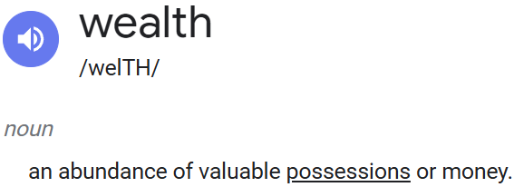
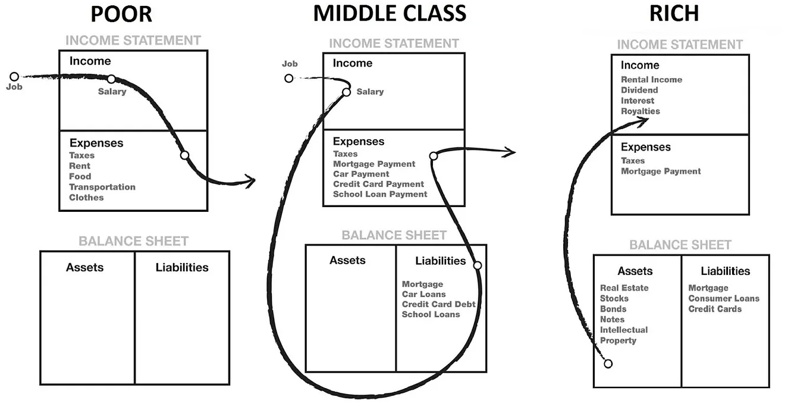
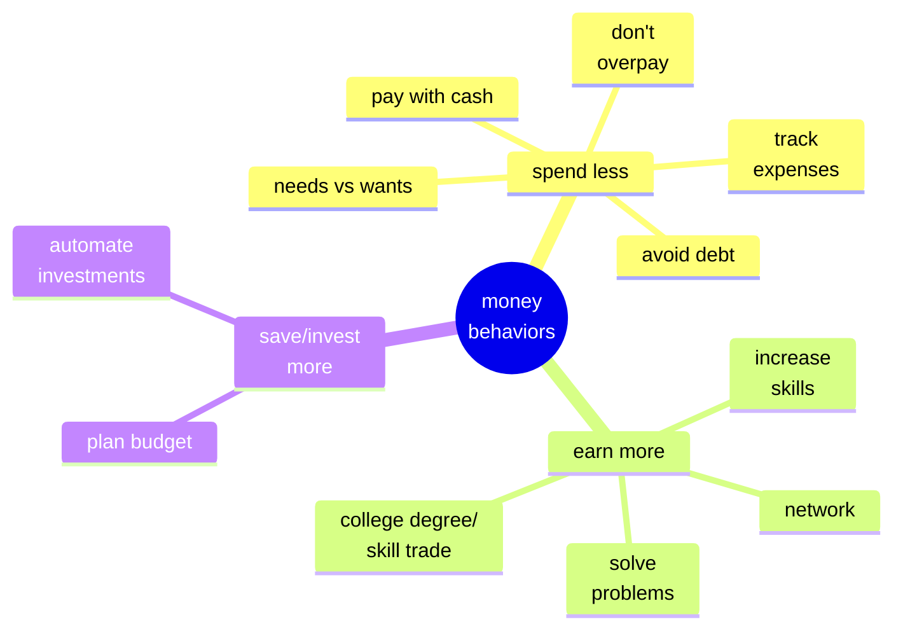
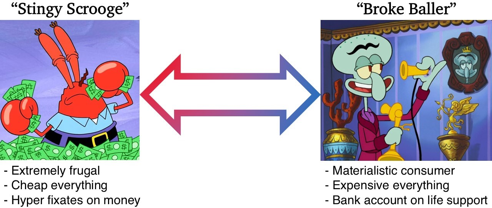
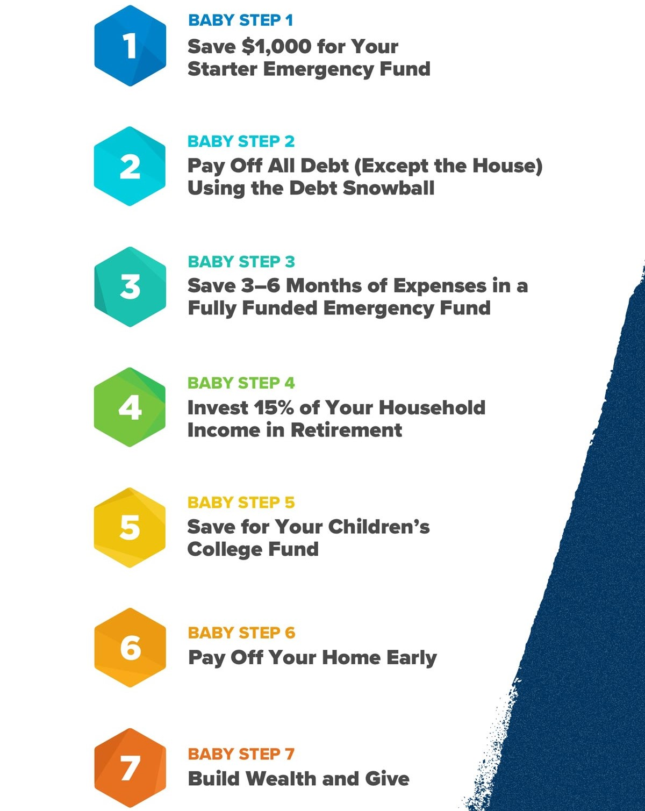
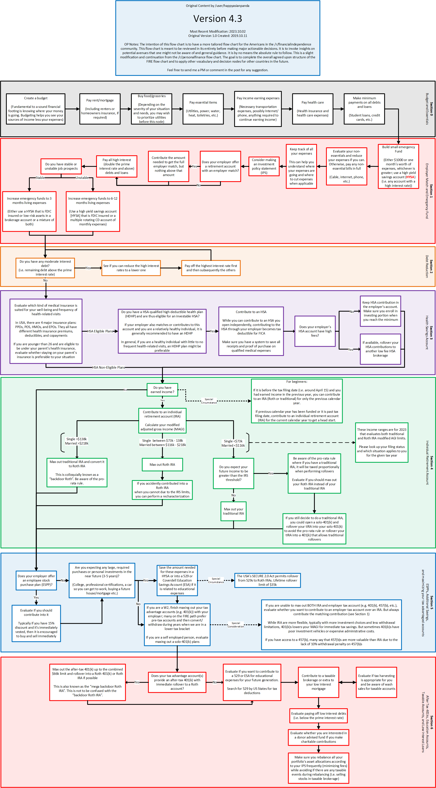
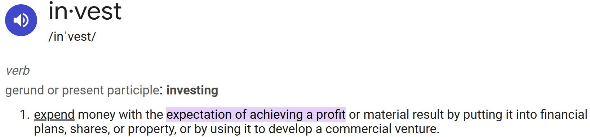
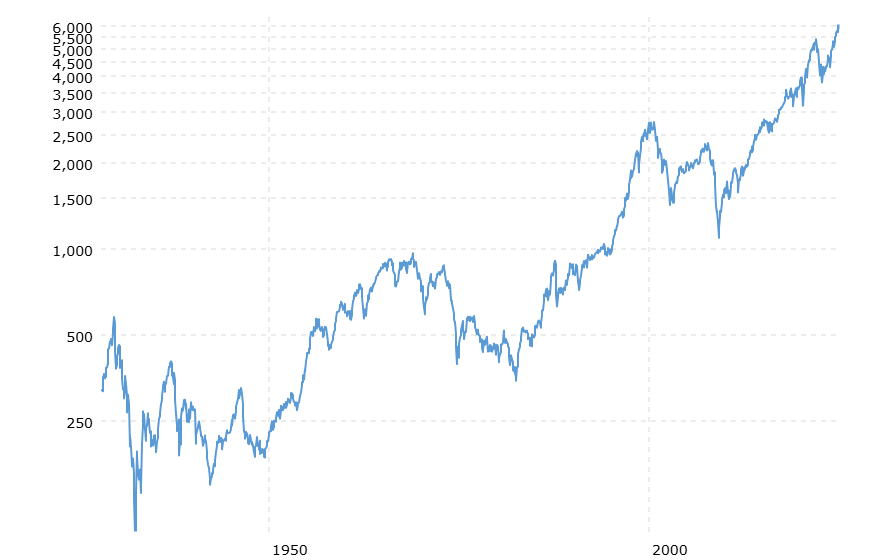
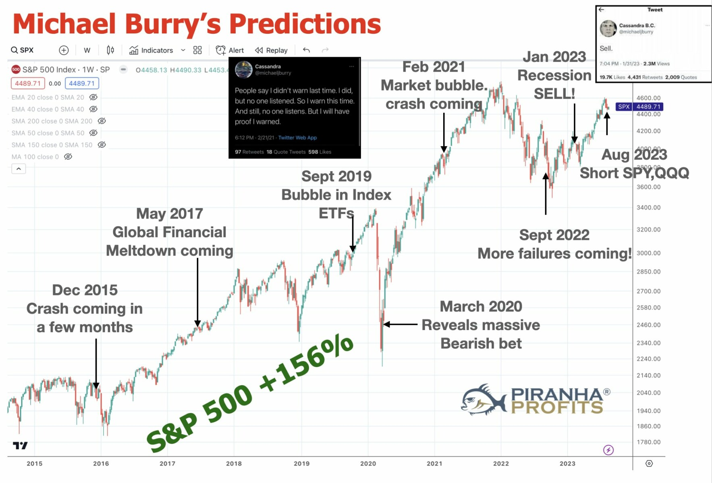
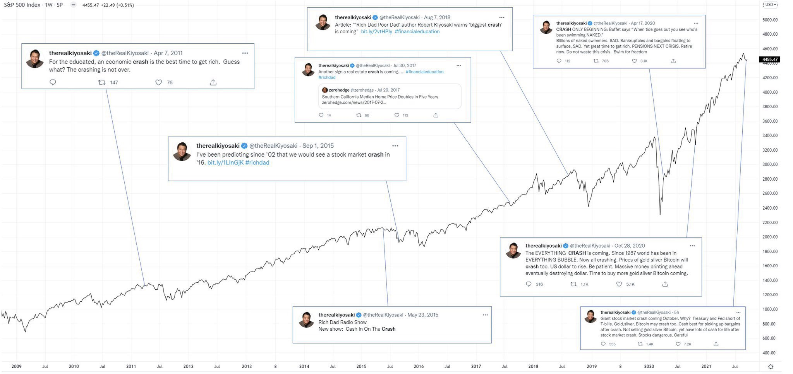

# Get Rich or Die Tryin'

## Why Become Wealthy?

Some people want to be rich so they can <a href="https://www.reddit.com/r/wallstreetbets/comments/q4p7zf/which_one_of_you_picked_up_my_wife_in_this/" target="_blank">buy a lambo.</a> Or maybe they want a bunch of <a href="https://www.youtube.com/watch?v=0yrIvEgqAuo" target="_blank">hookers and cocaine.</a>

> "Money talks, wealth whispers"

Generally, reasons to become wealthy include: 

<!-- maybe replace the bullets below with a tree map? -->
- **Lifestyle Choices** - higher quality of life 
- **Generational Legacy** - better life for your family 
- **Financial Freedom** - buy back your time = do whatever you want to do, whenever

    > “Escape the rat race”

<iframe src="https://www.youtube.com/embed/JCGNVLhXqJY" 
        title="Rat Race A short film story by Steve Cutts" frameborder="0" allowfullscreen
        allow="accelerometer; autoplay; clipboard-write; encrypted-media; gyroscope; picture-in-picture" 
        style="position: absolute; width: 100%; height: 100%;">
</iframe>

## How Much is Enough? 

---

Once there was a man lying at the steps of a plaza. A passerby awoke the man to say, "I have a job for you--you can make some money!" The man replied, "Oggi ho già mangiato" (meaning, "Today I already ate") and went back to sleep.

---

Valuation is subjective. 

Nevertheless, a net worth of ~25x your annual expenses in income-producing assets is considered wealthy enough to sustain your current lifestyle... forever (following the 4% rule). 

## How to Build Wealth?

Abundance of money is accumulated by **living below your means** = spend less than you earn and invest the savings. 

Easier said then done when <a href="https://institute.bankofamerica.com/content/dam/economic-insights/paycheck-to-paycheck-lower-income-households.pdf" target="_blank">25%</a> of Americans are living paycheck to paycheck. Fortunately, living like a penny pincher on <a href="https://www.youtube.com/watch?v=-Cd0il371II" target="_blank">extreme cheapskates</a> is not required to build wealth. 
<!-- any sources/visuals to support this? -->

⬆️ Income - ⬇️ Expenses = ⬆️ Savings (more to invest)
 

Emphasis on controlling spending because:

1. It's easier to do 
2. Uncontrolled spending will eliminate any amounts of income 

Treat your personal finances the way a business manages its balance sheet. Prioritize investing in incoming producing assets that make you passive money. 

> “If you don’t find a way to make money while you sleep, you will work until you die.”     
> -- <cite>Warren Buffet</cite>

Assets put more money in your pocket, creating the “snowball effect” in building wealth. Liabilities drain money from your pocket, leaving you in a perpetual cycle of just scraping by to make “the next payment on [insert credit card, car loan, etc.]." See the <a href="https://www.richdad.com/" target="_blank">Rich Dad Poor Dad</a> graphic below:

Minimize expenses and maximize income to further drive up your savings rate, hence your ability to buy more assets and become wealthy faster. Eventually, your assets will generate enough passive income to fund your lifestyle. 

# Money Behaviors

Personal finances are relative. There is no “one size fits all.”

Regardless, practicing certain habits and money behaviors can improve your chances of achieving your financial goals.

<!-- Mermaid bubble map money habits -->

Saving & investing your money is 🔑, but its not an all or nothing game.  

Finances, like everything else in life, is about balance. What’s the point of buying back your time just to be bored? Life is short, enjoy it (responsibly).

Budgets bring balance to the force. Portion some fun money to enjoy experiences with friends and family, all while investing part of your income to stay on track towards building wealth.

<!-- Chart.js budget pie chart -->

Example Budget: $5000 Monthly Income

  <canvas id="myChart"></canvas>

:::note
The budget above is just an example for a single person. Category %s do not always scale across individual (levels of income) or area (cost of living).
Many free budget templates are available online, such as <a href="https://create.microsoft.com/en-us/templates/budgets" target="_blank">here</a> or <a href="https://www.youtube.com/watch?v=eKyAOjH3Crk" target="_blank">here.</a>
:::

# Financial Order of Operations 

Where to start first can be hard. Let's make it easy by identifying where your money will have the greatest utility for your current situation.

Dave Ramsey’s <a href="https://www.ramseysolutions.com/budgeting/how-to-win-with-money-in-7-easy-baby-steps" target="_blank">7 baby steps</a> is a popular and simple set of instructions on where your money should go first: 

Furthermore, the <a href="https://www.reddit.com/r/financialindependence/comments/16xymii/fire_flow_chart_version_43/" target="_blank">r/personalfinance</a> flowchart offers a more detailed set of instructions on where to put your money (click on image and zoom in to read): 

Each step builds off each other to create a foundation of financial…

- **Stability** (budget)
- **Security** (emergency fund)
- **Growth** (investments)

:::note
These are just general guidelines. Your situation may vary and require further research.
:::

# Investment Strategy

Buy and own income-producing assets to generate passive income. Investing makes your money work for you, rather than you work for your money.  

This section will focus on investing in shares of businesses (aka stocks) through low cost, broad market index funds because they contain the following ideal investment characteristics:
 
- **High returns** - average 6-8% annual return (after inflation)
- **Low risk** - diverse exposure + value goes up in long-term
- **High liquidity** - can sell and convert to cash in a few days
- **Low maintenance** - passsive investing requires little to no time 
- **Low taxes** - tax free growth with low capital gains tax at distribution
- **Easily accessible** - can purchase yourself on computer/phone for any amounts of money (fractional shares) 

## Guranteed Success

First, investing is not trading, speculation, gambling, or anything attempting to “get rich quick.”

Unlike casino games, investing in shares of high quality, profitable businesses for the long-term puts the odds in your favor. 

  

One can expect to achieve a profit when investing in stocks for the long term. <a href='https://www.macrotrends.net/2324/sp-500-historical-chart-data' target="_blank">The chart below</a> shows the inflation-adjusted S&P 500 index (top 500 U.S. companies by market cap) over the past 100 years.

  

On average, the S&P 500 yields an <a href="https://www.officialdata.org/us/stocks/s-p-500/1924?amount=100&endYear=2024" target="_blank">inflation-adjusted annualized return</a> of ~7%. Following the rule of 72, it takes ~10 years for the investment value to double.  
$$
\frac{72}{7} \approx 10 \text{ years}
$$

Moreover, <a href="https://ofdollarsanddata.com/just-keep-buying/" target="_blank">this graphic</a> shows annual returns of stock over 20 year periods spanning across the last 140 years:

  

“…over any 20 year period U.S. stocks have had no real negative returns (when including dividends)...”

You will always win... except there are 2 ways you can lose: 
1. You don't participate 
2. You sellout

## Long-term Outlook

The longer your time horizon, the longer your money can grow. 

Financial freedom shows that money is time. Compounding interest shows that time is money, expotentially!

<!-- Apex charts compound interest bar chart -->

Starting with \$0, investing \$1000/month for 40 years (at 7% avg annual return) saves \~\$0.5M dollars total, but results in \$2M dollars worth of gains. That's a 400% increase from the original ammount!

:::note
This is just an example to show the power of compounding. The goal is consistent investing over time at any amounts you can, small or large. <a href="https://www.calculator.net/investment-calculator.html?ctype=endamount&ctargetamountv=1%2C000%2C000&cstartingprinciplev=0&cyearsv=40&cinterestratev=7&ccompound=annually&ccontributeamountv=1%2C000&cadditionat1=end&ciadditionat1=monthly&printit=0&x=Calculate#calresult" target="_blank">Here's the investment calculator.</a>
:::

## Index Fund Allocation

Warren Buffet, one of the greatest and wealthiest investors of all time, says to, <a href="https://www.youtube.com/watch?v=y4tITwhEfFE&app=desktop&ab_channel=Twin" target="_blank">"consistently buy low cost S&P 500 index funds through thick and thin."</a> Examples of these funds include Fidelity's <a href="https://fundresearch.fidelity.com/mutual-funds/summary/315911750" target="_blank">FXAIX</a> or Vanguard's <a href="https://investor.vanguard.com/investment-products/mutual-funds/profile/vfiax" target="_blank">VFIAX.</a> 

Bogleheads follow in the footsteps of Jack Bogle, the creator of the index fund itself. The <a href="https://www.bogleheads.org/wiki/Bogleheads%C2%AE_investment_philosophy" target="_blank">Boglehead investment philosophy</a> adds greater stability and diversification by supplementing US stocks with bonds and international funds.

What index fund(s) you pick and how much you invest into each fund depend on your financial goals, risk tolerance, and time horizon (years until retirement). 

## Do's and Don'ts

- Do: always be buying stocks ✅
- Don't: try to time the market ❌

Ignore the doomers. People will frequently cry wolf because its good for biz and drives views. Take a look at people like Michael Burry or Robert Kiyosaki: 

There is a reason there are a plethora of quotes about market timing = bad: 

>“Time in the market beats timing the market.” 

>"The best time to invest was yesterday, the second best time is today."

>“[insert any investor’s name] has successfully called 25/2 market crashes.” 

>“In the short term, the market is a voting machine. In the long term, the market is a weighing machine.”

>“The markets can be irrational longer than you can remain solvent.”

# Conclusion

1. Find ways to make more money and spend less money. 
2. Use your savings to consistently buy income-producing assets, such as investing in low cost, broad market index funds.
3. Buy and hold these assets over time. 
4. Wait and become wealthy.

And always be in pursuit of developing your financial education.  

Thank you for reading! 

---

Further reading:
- <a href="https://www.mrmoneymustache.com/2013/02/22/getting-rich-from-zero-to-hero-in-one-blog-post/" target="_blank">Mr. Money Mustachianism</a>
- JL Collins <a href="https://jlcollinsnh.com/2011/06/08/how-i-failed-my-daughter-and-a-simple-path-to-wealth/" target="_blank">A Simple Path to Wealth</a> and the famous <a href="https://jlcollinsnh.com/stock-series/" target="_blank">Stock Series</a>
- Nick Magiulli's <a href="https://ofdollarsanddata.com/popular-posts/" target="_blank">Of Dollars And Data</a> and <a href="https://ofdollarsanddata.com/just-keep-buying/" target="_blank">Just Keep Buying</a> philosophy

